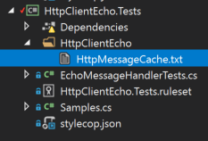

# HttpClientEcho


[](https://ci.appveyor.com/project/AArnott/httpclientecho/branch/master)
[](https://travis-ci.org/AArnott/HttpClientEcho)
[](https://codecov.io/gh/AArnott/HttpClientEcho)


Enables automated testing to test all local code without actually incurring
the cost and instability of network traffic, by recording a "live" test run
and replaying it for subsequent test runs.

## Usage

Consider the simplest use case of an HTTP call in a test:

```csharp
[Fact]
public async Task Simple()
{
    var httpClient = new HttpClient();
    var response = await httpClient.GetAsync("https://www.bing.com/");
    response.EnsureSuccessStatusCode();
}
```

The above test fails if the network fails or if the server throttles your tests requests.
By leveraging `HttpClientEcho` we can isolate this test from the network while still
emulating the server's full response.

First, install the [`HttpClientEcho` NuGet package][NuGet].
Thene simply pass in a `new EchoMessageHandler()` to the `HttpClient` constructor:

```csharp
[Fact]
public async Task Simple()
{
    var httpClient = new HttpClient(new EchoMessageHandler());
    var response = await httpClient.GetAsync("https://www.bing.com/");
    response.EnsureSuccessStatusCode();
}
```

The first time you run the test, it will contact the server and cache the result
with your test project (and tracked in source control where applicable).
Subsequent runs of your test will reuse the cached response and avoid the network call.

## How it works

The first time you run your tests, your test project transitions from this cache-less version:


After your test run, a cache file is added to your project:



The cache file itself is an easy-to-read representation of the network traffic that took place.
It is your HTTP traffic serialized in a near-HTTP protocol like fashion. For example,
with one cached request+response, the file would look something like this:

```
GET https://www.bing.com/

200 OK
Content-Length: 9
Content-Type: text/html; charset=utf-8

some data
```

[NuGet]: https://nuget.org/packages/HttpClientEcho
